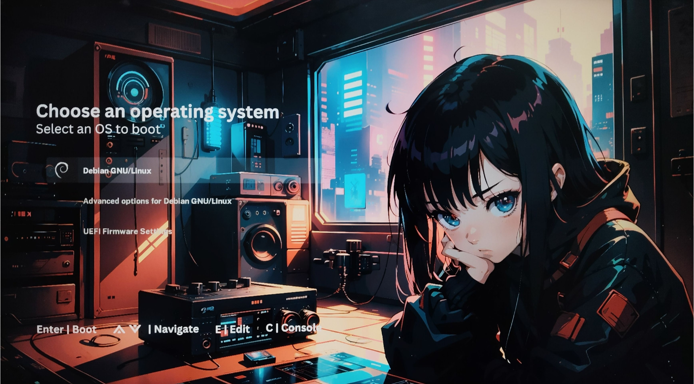
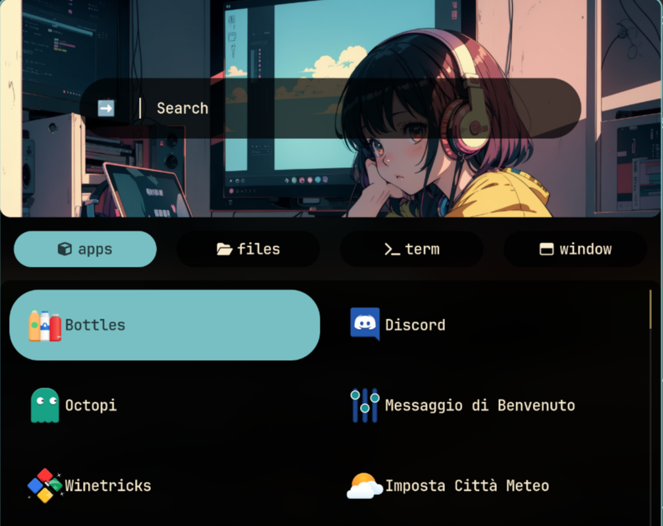
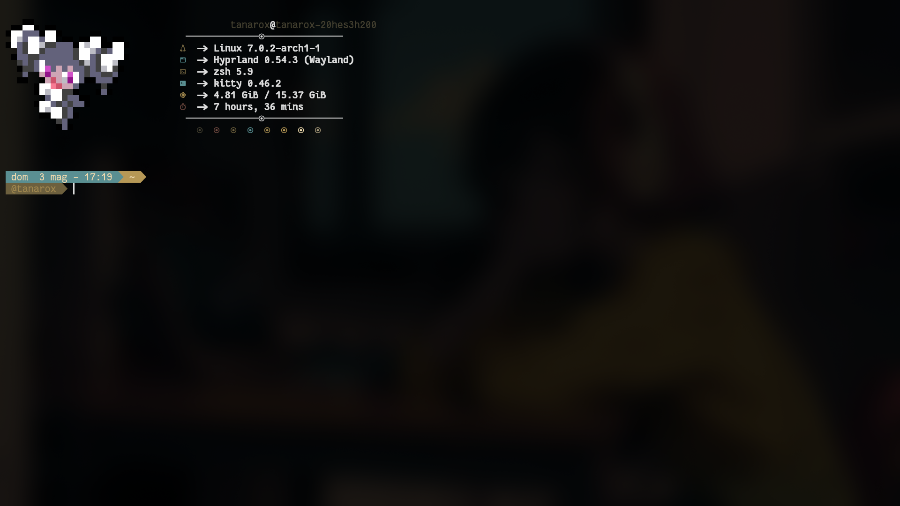
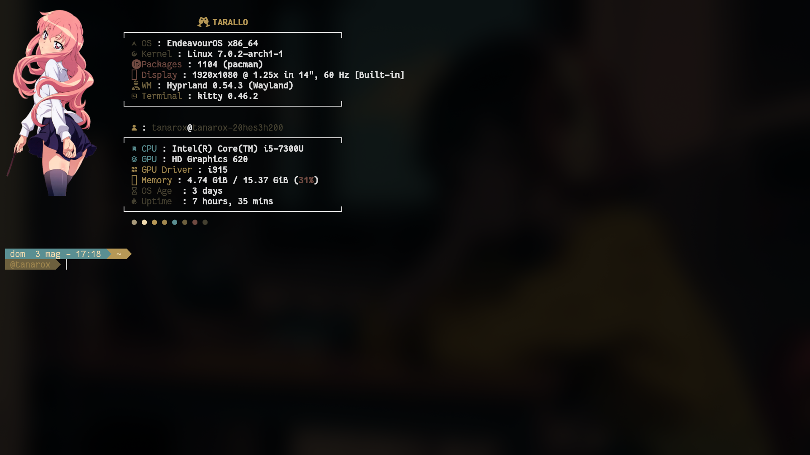

<div align="center">

# 💌 Script di installazione Tarallo — Arch Linux + Hyprland 💌

<br/>

<a href="#-cosa-aggiunge-questo-fork"><kbd> <br> Novità del fork <br> </kbd></a>&ensp;&ensp;
<a href="#-come-installare"><kbd> <br> Come installare <br> </kbd></a>&ensp;&ensp;
<a href="#-dopo-linstallazione"><kbd> <br> Dopo l'installazione <br> </kbd></a>&ensp;&ensp;
<a href="#-crediti"><kbd> <br> Ringraziamenti <br> </kbd></a>&ensp;&ensp;
<a href="#tasti-rapidi"><kbd> <br> Tasti rapidi <br> </kbd></a>&ensp;&ensp;

</div>

<div align="center">


</div>

---

## ✨ Cosa aggiunge in questo fork

Fork personalizzato dell'installatore originale JaKooLit/Arch-Hyprland, con le seguenti aggiunte:

| Funzione | Descrizione |
|---|---|
| 🇮🇹 Interfaccia in italiano | Tutti i messaggi, menu e dialoghi tradotti in italiano |
| 🌐 Scelta browser | Menu interattivo: Brave, Chromium, Firefox, LibreWolf, Opera GX, Vivaldi, Zen Browser |
| 🎮 Pacchetti Gaming | Selezione opzionale: Bottles, Heroic, Lutris, Steam, Wine Staging, Winetricks |
| 🎙️ Chat Vocale | Selezione opzionale: Discord, TeamSpeak 3 |
| 🎨 Tema GRUB | Tema KawaiiGRUB installato automaticamente con parametri `quiet` e `splash` abilitati di default<br><details><summary>Vedi screenshot</summary></details> |
| 📦 Pacchetti extra | VLC per i video, sintesi vocale e lettore multimediale inclusi di default |
| 👋 Saluto vocale al login | Messaggio di benvenuto vocale personalizzabile all'avvio della sessione |
| 🌤️ Rofi personalizzato | Messaggio di benvenuto e impostazione città meteo direttamente da rofi<br><details><summary>Vedi screenshot</summary></details> |
| 🔋 Notifica batteria | Avvisi automatici al livello critico della batteria, pensato per i portatili |
| 🔆 SwayOSD | OSD stile GNOME per retroilluminazione tastiera, luminosità schermo, volume e Caps Lock |
| 🖥️ Scelta fastfetch | Selezione del tema fastfetch: stile Pokémon oppure stile Tarallo<br><details><summary>Vedi screenshot</summary></details> |
| 💻 ThinkPad — Energia | Ottimizzazione automatica della batteria, delle ventole e della temperatura per una migliore durata e silenziosità |
| 🖐️ ThinkPad — Fingerprint | Lettore di impronte digitali configurato automaticamente: sblocca il PC e autorizza i comandi con il tocco di un dito |
| 👁️ ThinkPad — Viso IR | Accedi al PC con il tuo viso: la webcam a infrarossi ti riconosce automaticamente all'avvio |
| 🖥️ Selettore tema SDDM | GUI rofi a 3 colonne con miniature per scegliere tra tutti i temi SDDM installati (sddm-astronaut con 12 sotto-temi + standalone). Il riconoscimento facciale Howdy viene applicato automaticamente a ogni tema |
| 🔐 Configurazione biometrica | Wizard guidato al primo avvio: rileva automaticamente lettore impronte e webcam IR e guida la configurazione dell'autenticazione in pochi click. Se il PC non ha periferiche biometriche, il wizard lo rileva e si chiude senza mostrare nulla in seguito. Rilanciabile in qualsiasi momento da rofi |
| 📸 Snapshot del sistema | Salva automaticamente lo stato del sistema prima di ogni aggiornamento. Se qualcosa si rompe, puoi tornare indietro in pochi click. Gestibile anche da interfaccia grafica. **Funziona solo se hai scelto btrfs come filesystem durante l'installazione di Arch Linux e derivate (EndeavourOS, CachyOS, Garuda, Manjaro...)** |
| 🕹️ Game Launcher | Launcher giochi standalone con griglia dinamica Rofi. Rileva automaticamente i giochi installati su Steam, Lutris, Wine e dalle applicazioni desktop. Cover art scaricate automaticamente da Steam CDN e SteamGridDB. Barra di ricerca integrata e sfondo che mostra il cover dell'ultimo gioco lanciato. Al primo avvio guida la configurazione dell'API key gratuita direttamente da Rofi, senza bisogno di editare file. Keybinding Hyprland configurabile dall'installer |
| 🔤 OCR dallo schermo | `SUPER ALT T` seleziona un'area dello schermo e ne copia il testo negli appunti, anche da video in riproduzione o menu a comparsa (lo schermo viene congelato durante la selezione). Con `SUPER ALT SHIFT T` il testo passa a un'IA che lo riassume, traduce, spiega o corregge |
| 🎤 Dettatura vocale italiana | Tieni premuto `F9`, parla, rilascia: il testo viene scritto nella finestra attiva. Modello Whisper `large-v3-turbo` in italiano, tutto in locale, con accelerazione Vulkan dove disponibile (su una iGPU Vega: 6 secondi contro 21 della sola CPU). Il testo dettato viene ripulito da punteggiatura e ripetizioni prima di essere scritto — **con Gemini se inserisci una chiave API gratuita** (vedi *Dopo l'installazione*), altrimenti con l'IA locale |
| 👋 Schermata di benvenuto | Finestra di benvenuto GTK al primo avvio del desktop con azioni rapide: tasti rapidi, configurazione meteo, game launcher, setup biometrico, installazione pacchetti opzionali (browser, gaming, chat vocale) saltati durante il setup. Toggle per abilitare o disabilitare la comparsa all'avvio. Riapribile in qualsiasi momento |

---

## 📋 Prerequisiti

- Installazione **minimale** di Arch Linux (o derivata: EndeavourOS, CachyOS, Manjaro)
- Connessione internet attiva e pacchetto `curl` installato
- Consigliato: esegui un backup con `timeshift` o `snapper` prima di procedere

> [!IMPORTANT]
> Scarica questo script in una directory in cui hai i permessi di scrittura, ad esempio la tua home (`~`).

> [!NOTE]
> Lo script installerà **Pipewire** e disabiliterà PulseAudio. Se non lo desideri, commenta la riga `execute_script "pipewire.sh"` in `install.sh` prima di avviare.

---

## 🚀 Come installare

### Metodo 1 — Automatico

> [!CAUTION]
> Se usi **Fish Shell** usa il metodo manuale — il metodo automatico non è compatibile.

```bash
sh <(curl -L https://raw.githubusercontent.com/kilian85/Arch-Hyprland-Tarallo/main/auto-install.sh)
```

### Metodo 2 — Manuale

```bash
git clone --depth=1 https://github.com/kilian85/Arch-Hyprland-Tarallo.git ~/Arch-Hyprland
cd ~/Arch-Hyprland
chmod +x install.sh
./install.sh
```

---

## 🔧 Dopo l'installazione

- Premi `SUPER H` per i **suggerimenti** oppure clicca HINT! nella waybar
- I tasti rapidi sono accessibili con `SUPER SHIFT K` oppure clic destro su `HINTS`
- Per cambiare tema ZSH usa `SUPER SHIFT O`, poi riapri il terminale

### Chiave Gemini per la dettatura (facoltativa)

Il testo che detti con `F9` viene ripulito prima di essere scritto: punteggiatura, maiuscole, accenti e ripetizioni del parlato. Il lavoro può farlo Gemini, che l'italiano lo conosce molto meglio dei modelli piccoli che girano in locale.

Apri la **schermata di benvenuto** (è in rofi come «Hyprland Tarallo», o compare da sola al primo avvio) e premi **🎤 Dettatura vocale**: il wizard spiega come ottenerla su [AI Studio](https://aistudio.google.com/apikey), la chiede in un campo protetto, **verifica con Google che sia valida** prima di salvarla, e la scrive in `~/.config/dettatura-gemini.env` con i permessi giusti. Dallo stesso pulsante puoi in seguito provarla, sostituirla o rimuoverla — rimuovendola torna tutto in locale.

<details><summary>Preferisci farlo da terminale?</summary>

```bash
read -rsp "Chiave Gemini: " K
install -m600 /dev/null ~/.config/dettatura-gemini.env
echo "GEMINI_API_KEY=$K" > ~/.config/dettatura-gemini.env
unset K
```
</details>

Il modello usato è `gemini-3.5-flash-lite`: corregge senza riformulare e risponde in meno di un secondo. Si cambia con la variabile `DETTATURA_MODELLO_GEMINI`.

**Senza chiave non serve fare nulla**: la ripulitura viene fatta da qwen tramite Ollama, se installato, e in mancanza anche di quello il testo dettato viene scritto così com'è. Da tenere presente che **con la chiave attiva le frasi dettate vengono inviate ai server di Google**, mentre tutto il resto (dettatura, OCR, IA locale) resta sul tuo computer.

### Reinstallare uno script singolo

Dalla directory `Arch-Hyprland`, esegui lo script direttamente:

```bash
./install-scripts/gtk-themes.sh    # temi GTK
./install-scripts/sddm.sh          # SDDM
./install-scripts/fingerprint.sh   # lettore impronte
./install-scripts/howdy.sh         # riconoscimento facciale
./install-scripts/thinkpad.sh      # ottimizzazioni ThinkPad T470
```

> [!IMPORTANT]
> Non entrare nella directory `install-scripts` con `cd` prima di eseguire gli script.

---

## 📊 Script di monitoraggio del sistema

| Script | Installa | Servizio |
|---|---|---|
| `./install-scripts/battery-monitor.sh` | `acpi`, `libnotify` | `battery-monitor.service` |
| `./install-scripts/disk-monitor.sh` | `libnotify` | `disk-monitor.service` |
| `./install-scripts/temp-monitor.sh` | `lm_sensors`, `libnotify` | `temp-monitor.service` |

Gestione: `systemctl --user status|start|stop <nome-servizio>`

---

## 📝 Note

### Temi SDDM e GTK
- **Temi SDDM**: se selezioni l'opzione apposita vengono installati `simple_sddm_2`, `sddm-astronaut-theme` (con 12 sotto-temi) e `sugar-candy`. I temi `elarun`, `maldives` e `maya` sono già inclusi nel pacchetto `sddm`. Tutti i temi sono selezionabili dalla GUI grafica dopo l'installazione
- **Temi GTK**: includono icone e il cursore Bibata Modern Ice

### Passare da GDM a SDDM
```bash
sudo systemctl disable gdm.service
# riavvia, accedi da TTY, poi esegui ./install.sh
```

### GPU Nvidia
- Viene installato `nvidia-dkms` (GTX 900 e successive). Per driver più vecchi modifica `nvidia.sh`
- Per problemi con monitor esterni consulta wiki.hyprland.org

### ZSH e Oh-My-Zsh
Il tema predefinito è `agnosterzak`. Per cambiarlo modifica `ZSH_THEME` in `~/.zshrc`.

---

## ⚠️ Problemi noti

- **Pipewire**: su Arco Linux / EndeavourOS installa prima `pipewire pipewire-pulse pipewire-audio` se usi ancora PulseAudio
- **ROFI**: se già installato potrebbe avere problemi di scala — `sudo pacman -Rns rofi && sudo pacman -S rofi-wayland`
- **cava**: su Arch appena installata potrebbe bloccarsi. Dopo il boot: `yay -S cava-git`

---

## 🗑️ Disinstallazione

```bash
./uninstall.sh
```

> Usalo con cautela. Il metodo più sicuro per ripristinare rimane `timeshift` o `snapper`.

---

## 👍 Crediti

- **JaKooLit** — installatore originale e Hyprland-Dots
- **Hyprland** e @vaxerski — per questo fantastico Dynamic Tiling Manager

---

<a id="tasti-rapidi"></a>
<details>
<summary><h2>⌨️ Tasti rapidi — Tarallo Hyprland</h2></summary>

> `SUPER` = tasto Windows/Meta

### 🚀 App e funzioni principali

| Tasto | Azione |
|---|---|
| `SUPER + D` | Apri launcher app (Rofi) |
| `SUPER + Return` | Apri terminale |
| `SUPER + SHIFT + Return` | Terminale dropdown |
| `SUPER + E` | Apri file manager |
| `SUPER + B` | Apri browser predefinito |
| `SUPER + G` | Game Launcher |
| `SUPER + A` | Vista generale del desktop |
| `SUPER + H` | Mostra suggerimenti / cheat sheet |
| `SUPER + F2` | Cambia profilo energetico (Risparmio → Bilanciato → Prestazioni) |

### 🎨 Tema e aspetto

| Tasto | Azione |
|---|---|
| `SUPER + T` | Cambia tema globale (Wallust) |
| `SUPER + W` | Seleziona sfondo |
| `SUPER + SHIFT + W` | Effetti sfondo |
| `SUPER + CTRL + ALT + W` | Sfondo casuale |
| `SUPER + CTRL + B` | Menu stili Waybar |
| `SUPER + ALT + B` | Menu layout Waybar |
| `SUPER + CTRL + ALT + B` | Mostra/nascondi Waybar |
| `SUPER + SHIFT + A` | Menu animazioni |
| `SUPER + SHIFT + G` | Modalità gioco (animazioni ON/OFF) |
| `SUPER + SHIFT + O` | Cambia tema Oh-My-Zsh |
| `SUPER + CTRL + R` | Selettore tema Rofi |
| `SUPER + CTRL + SHIFT + R` | Selettore tema Rofi v2 |

### 🪟 Gestione finestre

| Tasto | Azione |
|---|---|
| `SUPER + Q` | Chiudi finestra attiva |
| `SUPER + SHIFT + Q` | Termina processo attivo |
| `SUPER + SPACE` | Finestra flottante |
| `SUPER + ALT + SPACE` | Tutte le finestre flottanti |
| `SUPER + SHIFT + F` | Schermo intero |
| `SUPER + CTRL + F` | Schermo intero finto |
| `SUPER + CTRL + G` | Raggruppa/separa finestre |
| `SUPER + Tab` | Cambia finestra nel gruppo (avanti) |
| `SUPER + SHIFT + Tab` | Cambia finestra nel gruppo (indietro) |
| `ALT + Tab` | Cicla finestra successiva |
| `SUPER + CTRL + O` | Toggle opacità finestra attiva |
| `SUPER + ALT + O` | Attiva/disattiva sfocatura |
| `SUPER + ALT + L` | Cambia layout Dwindle / Master |

### 🔀 Spostamento finestre

| Tasto | Azione |
|---|---|
| `SUPER + frecce` | Sposta focus |
| `SUPER + CTRL + frecce` | Sposta finestra |
| `SUPER + ALT + frecce` | Scambia finestra |
| `SUPER + SHIFT + frecce` | Ridimensiona finestra |
| `SUPER + mouse sinistro` | Trascina finestra |
| `SUPER + mouse destro` | Ridimensiona finestra |

### 🖥️ Workspace

| Tasto | Azione |
|---|---|
| `SUPER + 1-10` | Vai al workspace 1-10 |
| `SUPER + SHIFT + 1-10` | Sposta finestra al workspace 1-10 |
| `SUPER + CTRL + 1-10` | Sposta finestra silenziosamente |
| `SUPER + Tab` | Workspace successivo |
| `SUPER + SHIFT + Tab` | Workspace precedente |
| `SUPER + rotella mouse` | Scorrere tra workspace |
| `SUPER + U` | Workspace speciale (scratchpad) |
| `SUPER + SHIFT + U` | Sposta al workspace speciale |

### 📸 Screenshot

| Tasto | Azione |
|---|---|
| `SUPER + Stamp` | Screenshot immediato |
| `SUPER + SHIFT + Stamp` | Screenshot area (grim + slurp) |
| `SUPER + SHIFT + S` | Screenshot area (Swappy) |
| `SUPER + CTRL + Stamp` | Screenshot in 5 secondi |
| `SUPER + CTRL + SHIFT + Stamp` | Screenshot in 10 secondi |
| `SUPER + ALT + Stamp` | Screenshot finestra attiva |

### 🔊 Audio e media

| Tasto | Azione |
|---|---|
| `Volume Su/Giù` | Alza/abbassa volume |
| `ALT + Volume Su/Giù` | Volume preciso |
| `Muto` | Attiva/disattiva muto |
| `Muto microfono` | Attiva/disattiva microfono |
| `Play/Pausa` | Play/pausa |
| `Traccia avanti/indietro` | Traccia successiva/precedente |
| `SUPER + SHIFT + M` | Musica online (RofiBeats) |

### ⚙️ Sistema

| Tasto | Azione |
|---|---|
| `SUPER + CTRL + ALT + L` | Blocca schermo |
| `SUPER + CTRL + ALT + P` | Menu spegnimento |
| `SUPER + CTRL + ALT + Delete` | Esci da Hyprland |
| `SUPER + SHIFT + N` | Pannello notifiche |
| `SUPER + SHIFT + E` | Menu impostazioni rapide |
| `SUPER + N` | Attiva/disattiva luce notturna |
| `SUPER + S` | Ricerca web |
| `SUPER + ALT + E` | Menu emoji |
| `SUPER + ALT + V` | Gestore appunti |
| `SUPER + ALT + C` | Calcolatrice |
| `SUPER + SHIFT + K` | Cerca tasti rapidi |
| `SUPER + ALT + R` | Aggiorna barra e menu |

</details>

---

[](https://starchart.cc/kilian85/Arch-Hyprland-Tarallo)
